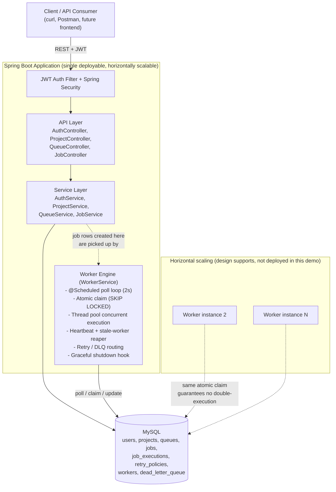

# Architecture Diagram

Paste into [mermaid.live](https://mermaid.live) to render/export.

```mermaid
flowchart TB
    Client["Client / API Consumer\n(curl, Postman, future frontend)"]

    subgraph App["Spring Boot Application (single deployable, horizontally scalable)"]
        API["API Layer\nAuthController, ProjectController,\nQueueController, JobController"]
        SEC["JWT Auth Filter + Spring Security"]
        SVC["Service Layer\nAuthService, ProjectService,\nQueueService, JobService"]
        WORKER["Worker Engine (WorkerService)\n- @Scheduled poll loop (2s)\n- Atomic claim (SKIP LOCKED)\n- Thread pool concurrent execution\n- Heartbeat + stale-worker reaper\n- Retry / DLQ routing\n- Graceful shutdown hook"]
    end

    DB[("MySQL\nusers, projects, queues, jobs,\njob_executions, retry_policies,\nworkers, dead_letter_queue")]

    Client -->|"REST + JWT"| SEC --> API --> SVC --> DB
    WORKER -->|"poll / claim / update"| DB
    SVC -.->|"job rows created here\nare picked up by"| WORKER

    subgraph Scale["Horizontal scaling (design supports, not deployed in this demo)"]
        W2["Worker instance 2"]
        W3["Worker instance N"]
    end
    W2 -.->|"same atomic claim\nguarantees no double-execution"| DB
    W3 -.-> DB
```

