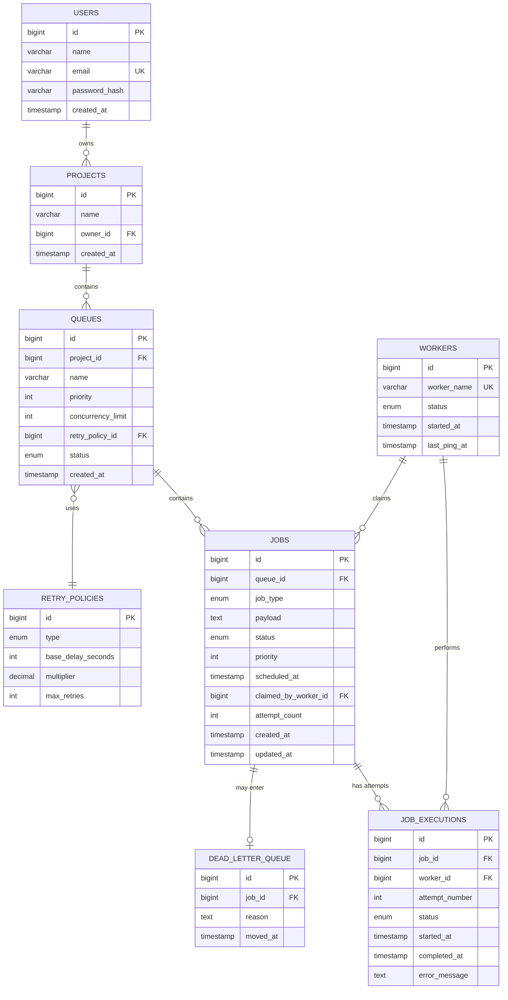

# ER Diagram

Paste this into [mermaid.live](https://mermaid.live) or draw.io (with the Mermaid
import option) to get a rendered/exportable diagram image for your submission.

## Key indexes
- `jobs(status, scheduled_at, priority)` — composite, supports the worker polling query
  (`WHERE status='QUEUED' AND scheduled_at<=NOW() ORDER BY priority DESC, scheduled_at ASC`)
- `users(email)` — unique, login lookup
- `projects(owner_id)` — "list my projects"
- `job_executions(job_id)` — fetch full attempt history for a job
- `workers(status, last_ping_at)` — stale-worker ("reaper") query
