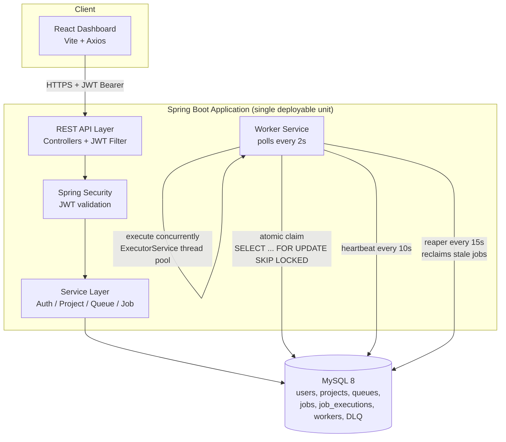
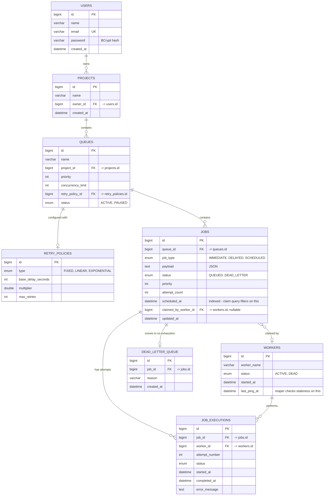

Table of contents
System Architecture
Database Design / ER Diagram
Setup — Backend
Setup — Frontend
API Documentation
Job Lifecycle
Design Decisions & Trade-offs
Testing
Known Gaps / Scope
Feature Coverage vs. Assignment Spec# Distributed Job Scheduler

A production-inspired distributed job scheduling platform: multi-tenant projects and
queues, atomic job claiming across concurrent workers, configurable retry strategies,
dead-letter handling, full execution history, and a live dashboard.

Built for the Codity.ai (SDE-1 Graduate Trainee) technical assessment.

**Tech stack** — Backend: Java 17, Spring Boot 3.2, MySQL 8, Spring Security + JWT,
Spring Data JPA (Hibernate), Lombok, springdoc-openapi (Swagger UI).
Frontend: React 18 + Vite, React Router, Axios.

---

## Table of contents

1. [System Architecture](#1-system-architecture)
2. [Database Design / ER Diagram](#2-database-design--er-diagram)
3. [Setup — Backend](#3-setup--backend)
4. [Setup — Frontend](#4-setup--frontend)
5. [API Documentation](#5-api-documentation)
6. [Job Lifecycle](#6-job-lifecycle)
7. [Design Decisions & Trade-offs](#7-design-decisions--trade-offs)
8. [Testing](#8-testing)
9. [Known Gaps / Scope](#9-known-gaps--scope)
10. [Feature Coverage vs. Assignment Spec](#10-feature-coverage-vs-assignment-spec)

---

## 1. System Architecture



**How the pieces fit together:**
- The API layer and the worker are two logical components but **one physical
  deployment** — the worker starts inside the same Spring Boot process (`@PostConstruct`
  in `WorkerService`) rather than as a separately deployed service. This keeps the
  assessment's scope realistic for the timeline while preserving a design that *would*
  scale to genuinely separate worker nodes: nothing in the claim mechanism depends on
  workers being co-located, since coordination happens entirely through the database
  (`SELECT ... FOR UPDATE SKIP LOCKED`), not through in-memory state. Running two
  instances of this same JAR against the same database today already behaves as two
  independent, safely-coordinating workers.
- All cross-cutting concerns (auth, validation, error shape) sit in front of the
  service layer via Spring Security's filter chain and `@Valid` DTO validation, so
  controllers stay thin.
- The worker and the API never talk to each other directly — they only communicate
  through the database's transactional guarantees. This is what makes the claim
  mechanism safe under concurrency (see §7).

---

## 2. Database Design / ER Diagram



**Design reasoning:**

- **Three-level ownership chain** (`User → Project → Queue → Job`): every
  authorization check walks this chain (`getOwned(userId, projectId)`), so a user can
  never reach a queue or job that isn't provably theirs — there's no separate
  "permissions" table needed for the current single-owner-per-project model.
- **Retry policy is per-queue, not per-job**: normalized out into its own table because
  backoff strategy is an operational property of a queue ("the notifications queue
  always retries exponentially"), not something that should vary job-to-job within one
  queue.
- **`job_executions` is one row per *attempt*, not per job**: this is what makes retry
  history queryable — a job retried 3 times has 3 rows, each with its own worker,
  timestamps, and error message, giving a full timeline rather than just a final
  outcome.
- **The most important index**: a composite index on `jobs(status, scheduled_at,
  priority)`. Every claim query filters on `status = 'QUEUED' AND scheduled_at <=
  NOW()` and orders by `priority DESC, scheduled_at ASC` — and this query runs every 2
  seconds, forever, regardless of load. It's the single highest-leverage index in the
  schema because of *how often* it executes, not table size.
- **Cascading**: deleting a `Project` cascades to its `Queue`s, which cascade to their
  `Job`s/`JobExecution`s — a project is meaningless without its queues, and orphaned
  rows would be unreachable through the authorization chain anyway.

---

## 3. Setup — Backend

### Prerequisites
- Java 17+, Maven 3.8+, MySQL 8 running locally

### Steps
```bash
# 1. Database (or let it auto-create via createDatabaseIfNotExist=true)
mysql -u root -p -e "CREATE DATABASE jobscheduler;"

# 2. Configure — edit src/main/resources/application.properties if your
#    MySQL credentials/port differ from your local defaults

# 3. Build + run
cd backend
mvn clean install
mvn spring-boot:run
```
Tables are auto-created/updated via `spring.jpa.hibernate.ddl-auto=update`. The app
starts on whatever `server.port` is configured (this project uses `8090`). A worker
instance starts automatically in the same process and begins polling every 2 seconds —
no separate worker deployment needed to see the system run end-to-end.

### Verify
```bash
curl -X POST localhost:8090/api/auth/register -H "Content-Type: application/json" \
  -d '{"name":"Test","email":"test@x.com","password":"password123"}'
# → returns a JWT token
```

### API docs (Swagger UI)
`http://localhost:8090/swagger-ui.html` — click **Authorize**, paste a JWT (from
`/api/auth/login` or `/api/auth/register`), then try any protected endpoint directly
from the browser.

### Run tests
```bash
mvn test -Dtest=JobClaimConcurrencyTest   # proves atomic claim is race-safe
mvn test -Dtest=RetryPolicyTest           # proves backoff-delay math is correct
```

---

## 4. Setup — Frontend

### Prerequisites
- Node.js 18+

### Steps
```bash
cd frontend
npm install
npm run dev
```
Opens on `http://localhost:5173`. The Vite dev server proxies `/api/*` to the backend
(configured in `vite.config.js`) — make sure the proxy `target` there matches your
backend's actual port (`8090` by default in this project), so no CORS setup is needed.

### Using the dashboard
1. **Register** or **log in** (JWT is stored and attached to every request
   automatically).
2. **Select or create a project**, then **select or create a queue** inside it
   (priority, concurrency limit, retry policy).
3. **Submit a job** — Immediate, Delayed (runs after N seconds), or Scheduled (runs at
   a chosen date/time).
4. Toggle **Auto-refresh** on the Jobs table to watch status move through
   `QUEUED → CLAIMED → RUNNING → COMPLETED` (or retry/DLQ on failure) live.
5. Click **history** on any job to see every attempt, which worker ran it, and any
   error message.
6. **Queue stats** panel shows a live count of jobs by status.

---

## 5. API Documentation

All endpoints except `/api/auth/**` require `Authorization: Bearer <token>`.

### Auth

| Method | Endpoint | Body | Returns |
|---|---|---|---|
| POST | `/api/auth/register` | `{name, email, password}` | `{token, email, id}` |
| POST | `/api/auth/login` | `{email, password}` | `{token, email, id}` |

### Projects

| Method | Endpoint | Purpose |
|---|---|---|
| POST | `/api/projects` | Create a project — `{name}` |
| GET | `/api/projects` | List your projects |
| GET | `/api/projects/{id}` | Get one (must be owned by caller) |
| DELETE | `/api/projects/{id}` | Delete (cascades to queues/jobs) |

### Queues

| Method | Endpoint | Purpose |
|---|---|---|
| POST | `/api/projects/{id}/queues` | Create a queue — `{name, priority, concurrencyLimit, retryType, baseDelaySeconds, multiplier, maxRetries}` |
| GET | `/api/projects/{id}/queues` | List queues in a project |
| GET | `/api/queues/{id}/stats` | Job counts by status for a queue |

### Jobs

| Method | Endpoint | Purpose |
|---|---|---|
| POST | `/api/jobs` | Submit a job — `{queueId, jobType, payload, priority, delaySeconds?, scheduledAt?}` |
| GET | `/api/jobs/{id}` | Get a job |
| GET | `/api/jobs/{id}/history` | Execution attempt history |
| GET | `/api/jobs/queue/{queueId}?page=&size=&sort=` | Paginated job list for a queue |
| POST | `/api/jobs/{id}/retry` | Manually re-queue a job (e.g. from DLQ) |

`jobType` is one of `IMMEDIATE`, `DELAYED` (requires `delaySeconds`), `SCHEDULED`
(requires `scheduledAt` as an ISO datetime, e.g. `"2026-08-25T14:30:00"`).

### Example: full flow

```bash
TOKEN=$(curl -s -X POST localhost:8090/api/auth/register -H "Content-Type: application/json" \
  -d '{"name":"Omkar","email":"omkar@test.com","password":"password123"}' | jq -r .token)

PROJECT_ID=$(curl -s -X POST localhost:8090/api/projects -H "Authorization: Bearer $TOKEN" \
  -H "Content-Type: application/json" -d '{"name":"Notification System"}' | jq -r .id)

QUEUE_ID=$(curl -s -X POST localhost:8090/api/projects/$PROJECT_ID/queues \
  -H "Authorization: Bearer $TOKEN" -H "Content-Type: application/json" \
  -d '{"name":"order-notifications","priority":8,"concurrencyLimit":5,"retryType":"EXPONENTIAL","baseDelaySeconds":10,"multiplier":2.0,"maxRetries":3}' | jq -r .id)

curl -X POST localhost:8090/api/jobs -H "Authorization: Bearer $TOKEN" \
  -H "Content-Type: application/json" \
  -d "{\"queueId\":$QUEUE_ID,\"jobType\":\"IMMEDIATE\",\"payload\":\"{\\\"type\\\":\\\"email\\\",\\\"to\\\":\\\"user@x.com\\\"}\",\"priority\":8}"
```

### Error shape

All errors return a consistent JSON structure via `GlobalExceptionHandler`:
```json
{ "error": "Bad Request", "message": "Email already registered", "status": 400, "timestamp": "..." }
```

---

## 6. Job Lifecycle

```
QUEUED ──(claim)──▶ CLAIMED ──(pickup)──▶ RUNNING ──(success)──▶ COMPLETED
   ▲                                          │
   │                                          │ failure, attempts remain
   └──────────────(backoff delay)─────────────┘
                                               │
                                               │ failure, attempts exhausted
                                               ▼
                                          DEAD_LETTER
```
Any job stuck in `CLAIMED`/`RUNNING` under a worker whose heartbeat goes stale
(`last_ping_at` older than 30s) is force-reset to `QUEUED` by the reaper — this is what
makes the lifecycle crash-safe: a killed or hung worker's in-flight jobs are
automatically reclaimed within one reaper cycle (worst case ~45s), not lost.

`DELAYED` and `SCHEDULED` jobs enter the same state machine — the only difference is
what `scheduled_at` is set to at creation (`now() + delaySeconds` vs. an explicit
timestamp); the worker treats them identically from that point on.

**Retry backoff formulas:**

| Strategy | Formula | Example (base=10s, attempt 3) |
|---|---|---|
| FIXED | `base` | 10s every time |
| LINEAR | `base × attemptNumber` | 30s |
| EXPONENTIAL | `base × multiplier^attemptNumber` | 80s (multiplier=2) |

---

## 7. Design Decisions & Trade-offs

**Atomic claiming via `SELECT ... FOR UPDATE SKIP LOCKED`, not application-level
locking.** The alternative (SELECT then UPDATE as two steps, or an in-memory lock) has
a race window between reading a job as available and marking it claimed — two workers
polling within milliseconds of each other could both grab the same job. Wrapping the
select-and-lock inside `FOR UPDATE`, and letting `SKIP LOCKED` make concurrent workers
skip rows that are mid-claim rather than blocking on them, moves the entire guarantee
into the database transaction itself — proven correct by `JobClaimConcurrencyTest`
rather than just assumed. The MySQL-specific derived-table wrapper
(`SELECT id FROM (SELECT ... ) AS t`) exists only because MySQL forbids selecting from
the same table being updated in a subquery — a portability note if migrating to
Postgres (which doesn't have this restriction).

**Retry policy is queue-level, not job-level.** Normalizing it into its own
`retry_policies` table (rather than duplicating backoff config onto every job row) was
chosen because backoff strategy is an operational property of a queue, and this avoids
data duplication and keeps a queue's retry behavior consistent and independently
editable.

**Notification-system domain for job payloads.** `payload` is a free-form JSON string
(`{"type":"email","to":...}`) rather than a strongly-typed column, because the
scheduler's job is to execute *arbitrary* background work reliably — the payload
schema is a concern of whatever's consuming it (`runJobLogic()`), not the scheduler
itself. `runJobLogic()` simulates ~500ms of work with a ~30% random failure rate so the
retry and DLQ paths are visibly exercised end-to-end without needing a real external
service.

**Polling-based live updates in the frontend, not WebSockets.** A 3-second polling
toggle is simpler to implement correctly under the assessment's time constraint than a
WebSocket channel, and sufficient for a dashboard where a few seconds of staleness is
acceptable — this was an explicit scope cut (WebSocket live updates was a listed bonus
feature), not an oversight.

**Recurring (cron) and Batch job types were deprioritized.** `Immediate`, `Delayed`,
and `Scheduled` share one execution path (they differ only in what `scheduled_at` is
set to at creation); Recurring/Batch would need materially different mechanisms (a cron
parser + a "next occurrence" scheduler for recurring; a fan-out/fan-in coordination
step for batch). Given the timeline, effort went into making the core claim/retry/DLQ
mechanism *provably* correct rather than spreading it across more job types more
shallowly.

---

## 8. Testing

- **`JobClaimConcurrencyTest`** (integration) — two threads, synchronized via
  `CountDownLatch` to race as close to simultaneously as the JVM allows, both call
  `claimJobs()` on the same queued job. Asserts exactly one succeeds and the job ends
  up `CLAIMED`. Deliberately *not* `@Transactional` — wrapping it in one Spring-managed
  transaction would serialize both calls and defeat the entire point of the test.
- **`RetryPolicyTest`** (unit) — verifies the FIXED/LINEAR/EXPONENTIAL delay formulas
  produce the correct values.

**What this proves:** the row-level locking is doing real work under real concurrency,
not just "probably fine in practice."

**What it doesn't cover** (honest gap): sustained high-concurrency behavior over a long
run, the reaper firing mid-claim, and no controller/service-layer tests exist yet.

---

## 9. Known Gaps / Scope

Deliberate trade-offs given the assessment's timeline, not oversights:

- **Recurring (cron) and Batch job types** — not implemented (see §7 reasoning).
- **Queue pause is cosmetic** — `PATCH` sets a queue's status, but the worker's claim
  query doesn't currently filter on it, so an already-`QUEUED` job in a paused queue can
  still be claimed. Documented here rather than left silent.
- **No filtering** on list endpoints beyond pagination.
- **No explicit idempotency handling** on job execution.
- **No WebSocket live updates** — polling only (explicit bonus-feature scope cut).
- **Bonus features not implemented**: rate limiting, distributed locking beyond the
  DB-level claim, queue sharding, event-driven execution, RBAC, AI-generated failure
  summaries.
- **Thin test coverage** beyond the two tests above — no reaper test, no end-to-end
  retry→DLQ transition test.

---

## 10. Feature Coverage vs. Assignment Spec

| Requirement | Status |
|---|---|
| Auth + Project → multiple Queues | ✅ |
| Queue config (priority, concurrency, retry policy, pause/resume, stats) | ✅ (pause is cosmetic — see §9) |
| Job types: Immediate, Delayed, Scheduled | ✅ |
| Job types: Recurring, Batch | ❌ scoped out — §7/§9 |
| Worker: poll, atomic claim, concurrent execution, heartbeat, graceful shutdown | ✅ |
| Job lifecycle + retries + DLQ | ✅ |
| Retry strategies: fixed, linear, exponential | ✅ unit-tested |
| Execution logs, retry history, worker assignment, metrics | ✅ |
| Web dashboard | ✅ responsive, live via polling |
| Validation, auth, structured errors, logging | ✅ |
| Pagination | ✅ |
| Filtering | ❌ |
| Atomic job claiming | ✅ proven via integration test |
| Idempotency | ❌ |
| Bonus features | ❌ none implemented — deprioritized for core correctness |
